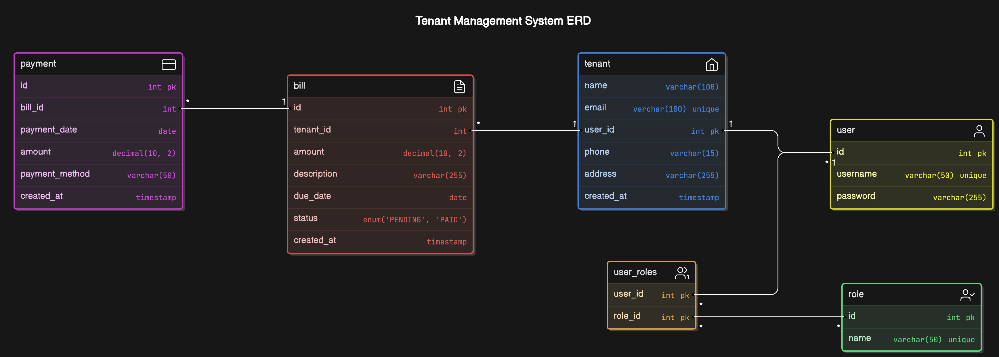

# Tenant Management System

The Tenant Management System is a full-featured application for condo management offices, enabling the tracking of tenants, bills, and payments. Built with **Spring Boot** for the backend, **MySQL** for data storage, and **Spring Security** for role-based authentication, this project serves as a portfolio showcase, demonstrating robust CRUD operations, user management, and secure access control.



## Table of Contents

- [Features](#features)
- [Technology Stack](#technology-stack)
- [Getting Started](#getting-started)
- [Project Structure](#project-structure)
- [Usage](#usage)
- [API Endpoints](#api-endpoints)
- [Future Enhancements](#future-enhancements)

## Features

- **Tenant Management**: Add, view, update, and delete tenant details.
- **Bill Management**: Track bills for tenants, including amounts, due dates, and statuses.
- **Payment Management**: Record payments against specific bills with detailed tracking.
- **Role-Based Access Control**:
    - `Admin` and `Manager` roles for system management.
    - `Tenant` users can access only their own information.
- **Secure Authentication**: Passwords are stored securely using BCrypt hashing.
- **RESTful API**: Enables easy integration with front-end clients.

## Technology Stack

- **Backend**: Java, Spring Boot, Spring Data JPA, Spring Security
- **Database**: MySQL
- **ORM**: Hibernate (JPA)
- **Authentication**: Spring Security with BCrypt
- **Build Tool**: Maven

## Getting Started

### Prerequisites

- **Java** 11 or above
- **Maven** 3.6 or above
- **MySQL** 5.7 or above

### Installation

1. **Clone the repository**:

   ```bash
   git clone https://github.com/yourusername/tenant-management-system.git
   cd tenant-management-system
   ```

2. **Configure the Database**:
    - Create a MySQL database named `condo_management`.
    - Update your `application.properties` with your MySQL credentials:

      ```properties
      spring.datasource.url=jdbc:mysql://localhost:3306/condo_management
      spring.datasource.username=YOUR_USERNAME
      spring.datasource.password=YOUR_PASSWORD
      spring.jpa.hibernate.ddl-auto=update
      spring.jpa.show-sql=true
      ```

3. **Run the Application**:

   ```bash
   mvn spring-boot:run
   ```

4. **Database Initialization**:
    - Upon starting, the app will initialize with default roles (`ROLE_ADMIN`, `ROLE_MANAGER`, `ROLE_TENANT`) and example users.
    - Use `admin` / `admin123` and `manager` / `manager123` credentials for initial access.

### Project Structure

- `src/main/java`: Contains the source code organized by `model`, `repository`, `service`, and `controller` packages.
- `src/main/resources`: Contains application properties and SQL initialization scripts.

## Usage

### Role-Based Access

- **Admin** and **Manager** users have access to all tenants, bills, and payments.
- **Tenant** users can log in to view and manage only their information.

### Authentication & Authorization

All endpoints are protected with role-based authentication. Only authenticated users with appropriate roles can access specific endpoints.

## API Endpoints

The following are some key endpoints of the Tenant Management System:

| Endpoint                  | Method | Description                        | Role         |
|---------------------------|--------|------------------------------------|--------------|
| `/api/tenants`            | GET    | Get all tenants                   | Admin/Manager|
| `/api/tenants/{id}`       | GET    | Get tenant by ID                  | Admin/Manager|
| `/api/bills`              | POST   | Create a new bill                 | Admin/Manager|
| `/api/payments`           | GET    | View all payments                 | Admin/Manager|
| `/api/tenants/me`         | GET    | View own tenant info              | Tenant       |
| `/api/tenants/{id}`       | PUT    | Update tenant information         | Admin/Manager|
| `/api/admin/**`           | -      | Restricted to Admin               | Admin only   |


## Future Enhancements

- **Front-End Integration**: Integrate with a React or Angular front end for a full-stack experience.
- **Advanced Filtering**: Add filters for tenants by status, payment, and billing history.
- **Notification System**: Notify tenants about upcoming bill payments via email.

## Contributing

Contributions are welcome! Please fork the repository and create a pull request with your changes.

## License

This project is licensed under the MIT License. See the [LICENSE](LICENSE) file for details.
